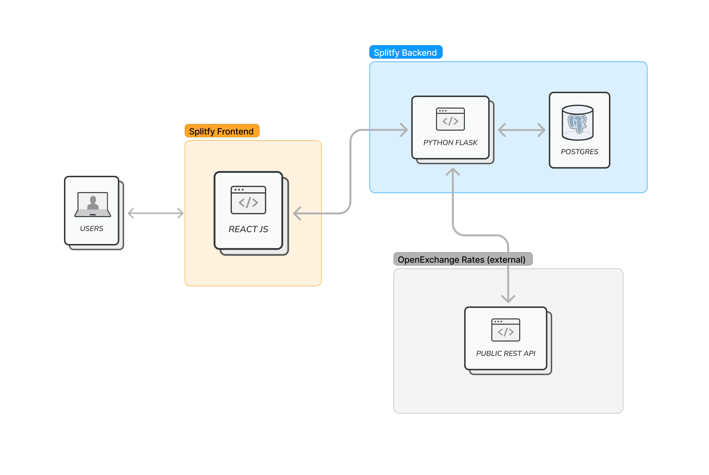

# Splitfy - Microservices

## Prerequisites

* [Python 3](https://www.python.org/downloads/)
* [Docker](https://www.docker.com/)
* [Docker Compose](https://docs.docker.com/compose/)

## Overview

### Repository structure
When developing Splitfy services we organize the repo structure having a dedicated repo for each component and a separate one for the docker compose file. 

### Components

#### Splitfy Frontend

Responsible for organinzing how the end user will visualize our application in order to manage their finances. It will exchange information with the Expenses backend to save and retrieve information through a REST API.

#### Splitfy Backend

Responsible for storing and managing expenses information and exposing REST API that can be consumed by other services. This service is using SQLite database to persist expense information.

#### Open Exchange Rates

Is an external service exposing HTTP REST API to be used to get USD/BRL exchange rates when saving or updating expenses.

## Running examples

Quickest way to try out examples is to run them with Docker Compose

`$ docker-compose up`

Wait until all services are up and Splitfy front-end will be available on port 3000. You can play with the application from there.

